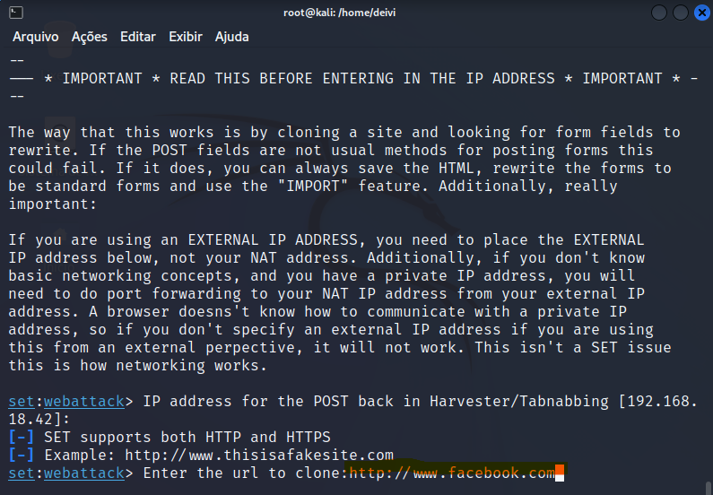

IVAN WAGNER

# Desafio Dio -  Criação de um Phishing com o Kali Linux


### **Criação de um Phishing com o Kali Linux**

O Kali Linux é uma distribuição Linux especializada em segurança da informação. Ela vem com uma série de ferramentas e programas que podem ser usados para realizar ataques de phishing.

Neste tutorial, mostraremos como criar um ataque de phishing usando o Kali Linux. Para isso, usaremos a ferramenta `setoolkit`.


#### **1. Instale o setoolkit**

O setoolkit é uma ferramenta de phishing que pode ser usada para criar ataques de phishing personalizados. Para instalar o setoolkit, execute o seguinte comando no terminal:


```plaintext
sudo apt-get install setoolkit
```


#### **2. Crie um ataque de phishing**

Para criar um ataque de phishing, execute o seguinte comando no terminal:


```plaintext
setoolkit
```

Isso abrirá o setoolkit. Selecione a opção `1` para criar um ataque de phishing.


#### **3. Selecione um tipo de ataque**

O setoolkit oferece vários tipos de ataques de phishing. Selecione o tipo de ataque que você deseja criar.


#### **4. Configure o ataque**

O setoolkit irá solicitar que você configure o ataque. Você pode fornecer um nome para o ataque, um endereço de e-mail de destino, um assunto para o e-mail e um corpo para o e-mail.


#### **5. Envie o ataque**

O setoolkit irá enviar o ataque para o endereço de e-mail que você forneceu.


#### **6. Espere os resultados**

Os resultados do ataque serão exibidos no terminal. Você poderá ver quantos e-mails foram entregues e quantos usuários foram infectados.


#### **7. Limpe o ataque**

Depois de terminar o ataque, você deve limpar o setoolkit. Para isso, execute o seguinte comando no terminal:

plaintext

```plaintext
setoolkit --cleanup
```

#### **Phishing**

O phishing é um ataque de segurança que visa roubar informações pessoais de um usuário, como senhas e números de cartão de crédito. O phishing geralmente é realizado por meio de e-mails ou mensagens de texto que parecem ser de uma fonte confiável, mas que na verdade são de um invasor.

O Kali Linux é uma distribuição Linux especializada em segurança da informação. Ela vem com uma série de ferramentas e programas que podem ser usados para realizar ataques de phishing.

Para criar um ataque de phishing, você pode usar a ferramenta `setoolkit`. O setoolkit é uma ferramenta de phishing que pode ser usada para criar ataques de phishing personalizados.

Para criar um ataque de phishing com o setoolkit, siga estas etapas:

1. Instale o setoolkit no Kali Linux.
2. Inicie o setoolkit.
3. Selecione a opção `1` para criar um ataque de phishing.
4. Selecione o tipo de ataque que você deseja criar.
5. Configure o ataque.
6. Envie o ataque.
7. Espere os resultados.
8. Limpe o setoolkit.


#### **Exemplo de ataque de phishing**

A seguir, é apresentado um exemplo de ataque de phishing criado com o setoolkit:


```plaintext
E-mail:

De: [NOME DO ENVIO]
Para: [NOME DO DESTINATÁRIO]
Assunto: [ASSUNTO DO E-MAIL]

Corpo do e-mail:

Olá [NOME DO DESTINATÁRIO],

Espero que esta e-mail o encontre bem.

Estou escrevendo para informá-lo sobre um novo programa de fidelidade que estamos lançando. Com este programa, você pode ganhar pontos toda vez que fizer uma compra em nossa loja. Os pontos podem ser trocados por produtos gratuitos ou descontos em suas compras futuras.

Para participar do programa, basta clicar no link abaixo e inserir seu nome e endereço de e-mail.

[LINK DO ATAQUE]

Obrigado por seu tempo.

Atenciosamente,
[NOME DO ENVIO]
```


#### **Como proteger-se de ataques de phishing**


Existem algumas medidas que você pode tomar para proteger-se de ataques de phishing:

- Nunca clique em links ou anexos em e-mails de fontes desconhecidas.
- Sempre verifique o endereço de e-mail do remetente.
- Se você tiver alguma dúvida sobre a validade de um e-mail, entre em contato com o remetente por telefone ou pessoalmente.
- Use um software antivírus atualizado.
- Mantenha suas senhas seguras.
- Não forneça informações pessoais sensíveis em sites que não são confiáveis.

**Se você acredita que foi vítima de um ataque de phishing, você deve alterar suas senhas e entrar em contato com seu banco ou empresa de cartão de crédito imediatamente.


## Criação de um Phishing com o Kali Linux

Neste desafio de projeto foi criado um Phishing para capturar senhas de login do Facebook.

## Ferramentas

- Kali Linux
- setoolkit

## Configurando o Phishing no Kali Linux

- Abrir o terminal e executar o comando de acesso ao root: ``` sudo su ```
- Iniciar o setoolkit: ``` setoolkit ```


- Selecionar o tipo de ataque: ``` Social-Engineering Attacks ```


- Selecionar o vetor de ataque: ``` Web Site Attack Vectors ```


- Selecionar o método de ataque: ``` Credential Harvester Attack Method ```


- Método de ataque: ``` Site Cloner ``` 


- Obter o endereço da máquina: ``` ifconfig ```
- Neste exemplo, usarei a URL para clone: [http://www.facebook.com](http://www.facebook.com/)





## ***Project not maintained anymore. Use [ZPhisher](https://github.com/htr-tech/zphisher)***

#
#

<p align="left">
<a href="#"></a>
</p>
<p align="center">
<a href="#"></a>
</p>
<p align="center">
<a href="https://github.com/htr-tech"></a>
<a href="#"></a>
</p>
<p align="center">
<a href="#"></a>
<a href="#"></a>
<a href="https://github.com/htr-tech/followers"></a>
<a href="https://github.com/htr-tech/nexphisher/stargazers/"></a>
<a href="https://github.com/htr-tech/nexphisher/network/members"></a>
<a href="https://github.com/htr-tech/nexphisher/watchers"></a>
</p>

## Installation :

* `apt update`
* `apt install git -y`
* `git clone git://github.com/htr-tech/nexphisher.git`
* `cd nexphisher`
#### > SETUP : `bash setup`
#### > SETUP [TERMUX] : `bash tmux_setup`
#### > Run : `bash nexphisher`

## Single Command :
```
apt update ; apt install git -y ; git clone git://github.com/htr-tech/nexphisher.git ; cd nexphisher ; bash setup ; bash nexphisher
```
<br>
<p align="center">


### <<< If you copy , Then Give me The Credits >>>

## Features :
#### [+] Latest Login Pages !
#### [+] 5 Port Forwarding Options !
#### [+] Easy for Beginners !


## Credits :

#### > Zphisher (https://github.com/htr-tech/zphisher)
#### > The Linux Choice (https://github.com/thelinuxchoice)
#### > DarkSecDevelopers (https://github.com/DarkSecDevelopers)
#### > Undeadsec (https://github.com/Undeadsec)


## Tunelling Options :

#### > Localhost (127.0.0.1)
#### > NGROK (https://ngrok.com)
#### > SERVEO (https://serveo.net)
#### > LOCALHOSTRUN (https://localhost.run)
#### > LOCALXPOSE (https://localxpose.io/)


